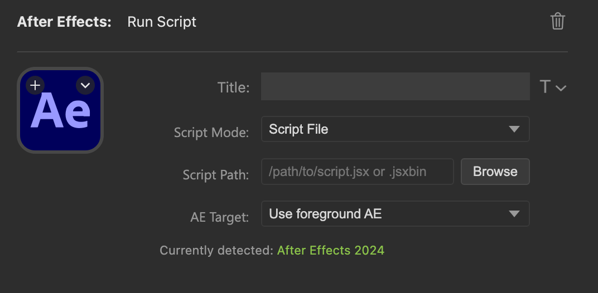
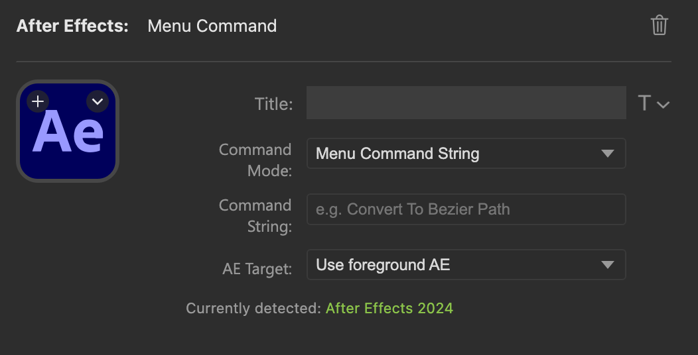

# After Effects for Stream Deck

Trigger After Effects scripts and menu commands from Stream Deck with one press. Set up your Stream Deck shortcuts once and use them for every version of After Effects you use.

This plugin adds two actions to Stream Deck:

- `Run Script` for `.jsx` / `.jsxbin` files or short inline ExtendScript snippets
- `Menu Command` for exact After Effects menu commands or known command IDs

## Features

- Run `.jsx` and `.jsxbin` files from Stream Deck
- Write short inline ExtendScript directly in the Property Inspector
- Trigger After Effects menu commands by exact menu string or numeric command ID
- Target the foreground AE app, the newest running AE instance, or a pinned installed version
- Use the same targeting options across both actions
- See running, success, and error feedback directly on the key

## Actions

### Run Script

Use this when the button should run ExtendScript directly.

- `Script File` points at a `.jsx` or `.jsxbin` file on disk
- `Inline Script` is useful for short snippets and quick one-off actions



### Menu Command

Use this when the button should trigger an existing After Effects menu item.

- `Menu Command String` runs `app.executeCommand(app.findMenuCommandId("..."))`
- `Command ID` runs `app.executeCommand(id)`
- Menu command strings are case sensitive and must match the After Effects menu text exactly
- If no exact menu-command match is found, the action fails instead of executing command ID `0`



## AE Targeting

Both actions support the same target selection:

- `Use foreground AE` targets the AE instance currently in front
- `Always use newest` targets the running AE instance with the highest version
- `Installed versions` pins a button to a specific installed AE version

The inspector also shows the currently detected running AE instance while it is open.

## Install

### Download a release

Download the latest `.streamDeckPlugin` from the repository Releases page and open it to install:

`https://github.com/jordan-steele/after-effects-stream-deck-plugin/releases/latest`

### Add a button

1. Open Stream Deck.
2. Find `After Effects > Run Script` or `After Effects > Menu Command`.
3. Drag the action onto a key.
4. Configure the action in the Property Inspector.

## Button Feedback

When you press a button:

| State | Color | Meaning |
|-------|-------|---------|
| Running | Amber | The command or script is being sent to After Effects |
| Success | Green | The action completed without an execution error |
| Error | Red | The action failed or no suitable AE instance was found |

The key resets to its default appearance after 2 seconds.

## Known Issues

### Window size restored when running a script (Windows)

On Windows, some versions of After Effects restore the window to its pre-maximized size when a script is invoked via the command line. This is an After Effects limitation with no clean fix — see this [Adobe community thread](https://community.adobe.com/questions-529/afterfx-command-line-restores-maximized-window-any-way-to-duplicate-extendscript-invocation-29238) for details.

As a partial mitigation, the plugin detects whether After Effects was maximized before the button was pressed and re-maximizes it afterward. This is handled in `runAfterFXPreservingWindow` in [src/script-runner.ts](src/script-runner.ts).

**Recommended workaround:** avoid running After Effects maximized. Instead, manually resize the After Effects window to fill the screen — this avoids the snapped/maximized state entirely and the window size will be preserved across script invocations.

## Development

### Local setup

```bash
git clone https://github.com/jordan-steele/after-effects-stream-deck-plugin.git
cd after-effects-stream-deck-plugin
npm install
```

### Commands

```bash
npm run build
npm run watch
npm run package
```

- `npm run build` assembles the plugin at `com.jordansteele.aftereffects.sdPlugin/`
- `npm run watch` rebuilds on change
- `npm run package` builds and creates a `.streamDeckPlugin` package in `dist/`

### Link for local testing

```bash
npx streamdeck link com.jordansteele.aftereffects.sdPlugin
```

Restart Stream Deck after linking if the plugin does not appear immediately.

### Release automation

The release workflow lives at `.github/workflows/release.yml`.

- Pushing a version tag builds the plugin, packages it, and creates or updates the matching GitHub Release with the `.streamDeckPlugin` file attached
- The same workflow can also be run manually with `workflow_dispatch`
- Packaging uses `--no-update-check` so CI does not depend on npm registry update checks from the Stream Deck CLI

### Project structure

```text
├── .github/workflows/release.yml
├── docs/screenshots/
├── plugin/
│   └── manifest.json
├── ui/
│   └── inspector.html
├── assets/
│   └── imgs/
├── src/
│   ├── plugin.ts
│   ├── run-script-action.ts
│   ├── menu-command-action.ts
│   ├── script-runner.ts
│   ├── ae-detection.ts
│   └── settings.ts
├── rollup.config.mjs
└── package.json
```
